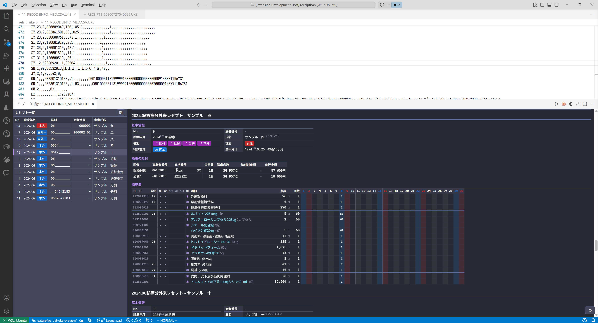
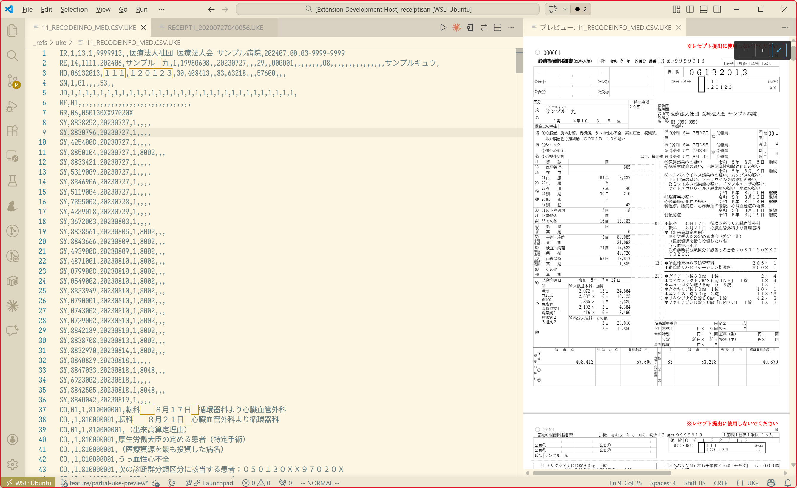
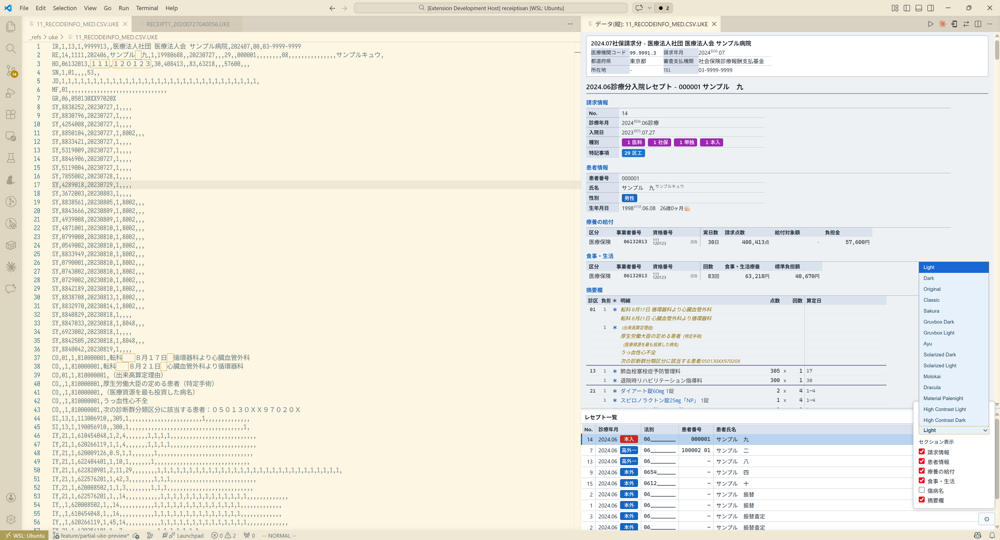
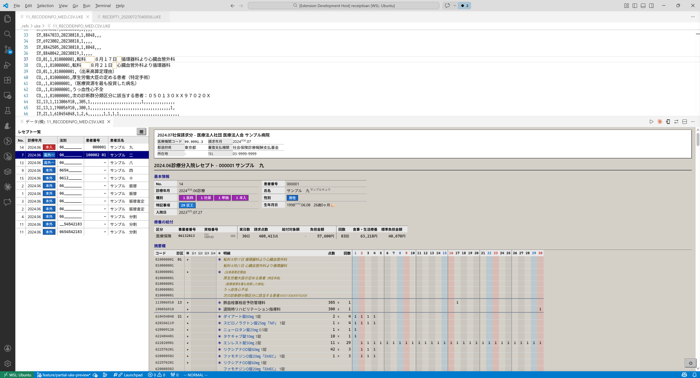

# receiptisan-vscode

電子レセプトファイル `RECEIPTC.UKE` の紙レセプト形式でプレビューしたりいわゆる会計カード的に可視化するVSCode拡張です。

UKEファイルの解析等バックエンドには[receiptisan](https://github.com/yokenzan/receiptisan)を利用しています。

| スクリーンショット                            |
|-----------------------------------------------|
|  |
|  |
|  |
|  |

